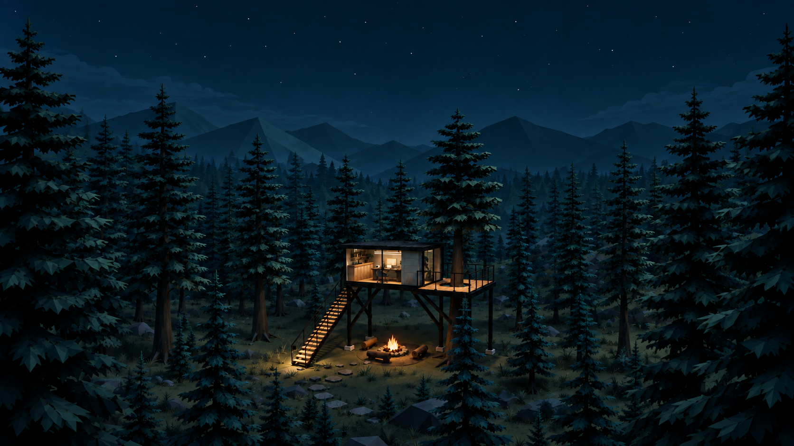
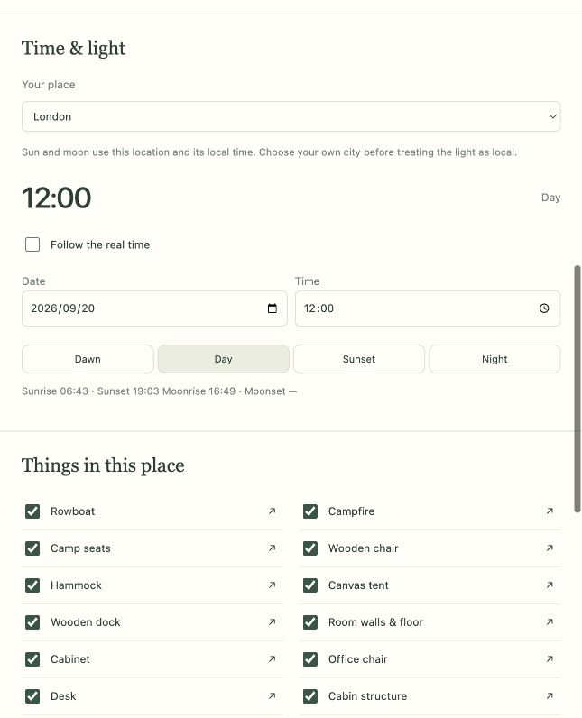

# Room2World

**把现实中的真实空间，搬进属于你的虚拟世界。**

[English](README.md) · [从这里开始](docs/zh/START_HERE.md)

*这是创作者的小屋作品展示。你将从自己现实中的房间开始。*

从现实房间的照片和尺寸出发，一步步还原它的布局、家具、材质，以及那些让你感到熟悉的小细节。再为它添上森林、湖面和你喜欢的世界。

你不用会建模，也不用会写代码。准备几张房间照片，把想法告诉 Codex，技术操作让它帮你完成。

这个项目提供的是一套做出自己小屋的方法，以及森林、湖面、日夜和交互的基础。第一次打开是引导页面；现成房间只是可选示例。

## 最简单的开始方式

把这个 GitHub 项目的链接复制给 Codex，再加上：

> 请用这个项目帮我制作自己的小屋。先下载到一个新文件夹，阅读里面的 AGENTS.md 和中文入门教程。用中文一步步引导我，先向我要房间四个方向的照片和主要尺寸，再和我确认布局。技术安装和建模请你帮我完成，每次修改前保存一个可以恢复的版本。不要直接拿示例房间替代我的房间。

准备一台电脑、你自己的 Codex 使用权限，以及手机拍的房间照片就好。项目本身不需要 API Key，不收取素材费用。安装软件遇到系统授权时，Codex 会请你协助。

也可以点击 GitHub 页面上的 **Code → Download ZIP**，解压后在 Codex 中打开文件夹。下载不需要注册 GitHub，也不需要你之后把小屋上传给别人。

## 你只需要做这几件事

1. **拍四个方向。** 每面墙一张，把门、窗和主要家具拍进去。
2. **告诉它几个尺寸。** 房间长宽、层高，以及大件家具的长宽高。不确定的就说是估计值。
3. **看第一版房间。** 对照照片，让它调整家具位置和比例。
4. **补拍材质细节。** 木纹、地板、椅子、天花板、台灯……这些很影响“像不像”。
5. **再扩展到森林。** 小屋、湖面、码头、帐篷、篝火，按照自己喜欢的节奏添加。
6. **随时保存，慢慢完善。** 做得不满意，可以恢复前一版。

[打开完整的简单教程 →](docs/zh/START_HERE.md)

## 已经为你准备好的内容

- 中英文引导页面，以及固定的创建步骤。
- 可以继续修改的三维模型源文件和建模流程，由 Codex 操作。
- 统一的森林插画质感、暖色室内光、大面积晚霞与远山层次。
- 会流动、会倒映场景的湖面，和可选的码头、小船、吊床、帐篷、篝火。
- 根据你的城市、日期和当地时间运行的太阳、月亮与光影。
- 单独显示、隐藏、定位每件物品。
- 默认关闭、由你主动开启的环境声音；夜晚有虫鸣，动效也可以关闭。
- 包含模型、代码、材质、设置的本地版本存档。

这不是一键扫描照片的工具。第一版会先搭好空间骨架，再由 Codex 对照你的照片细化。尺寸越清楚、细节照片越充分，越容易做出熟悉的感觉。

项目没有附带创作者的私人房间照片、家庭人物或品牌挂画。你的照片默认放在不上传的本地工作区中。

[项目结构与原理](docs/PROJECT.md) · [许可证](LICENSE)
