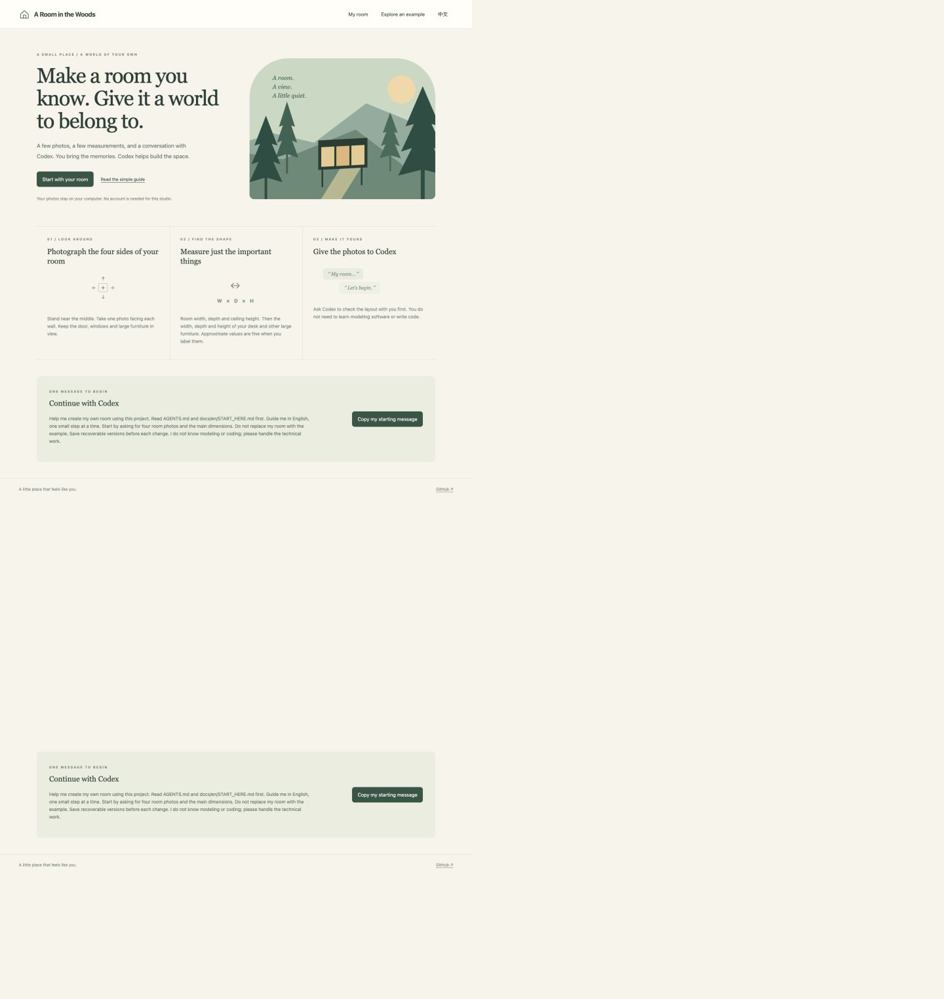
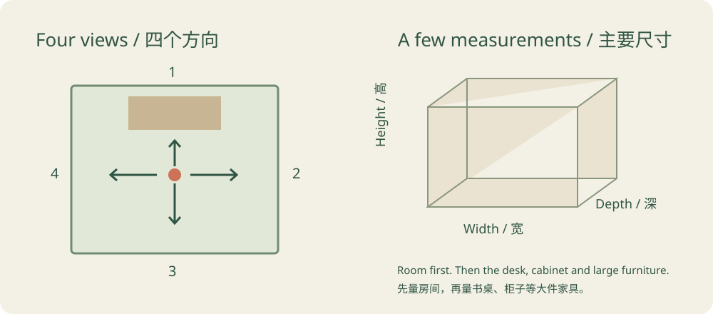
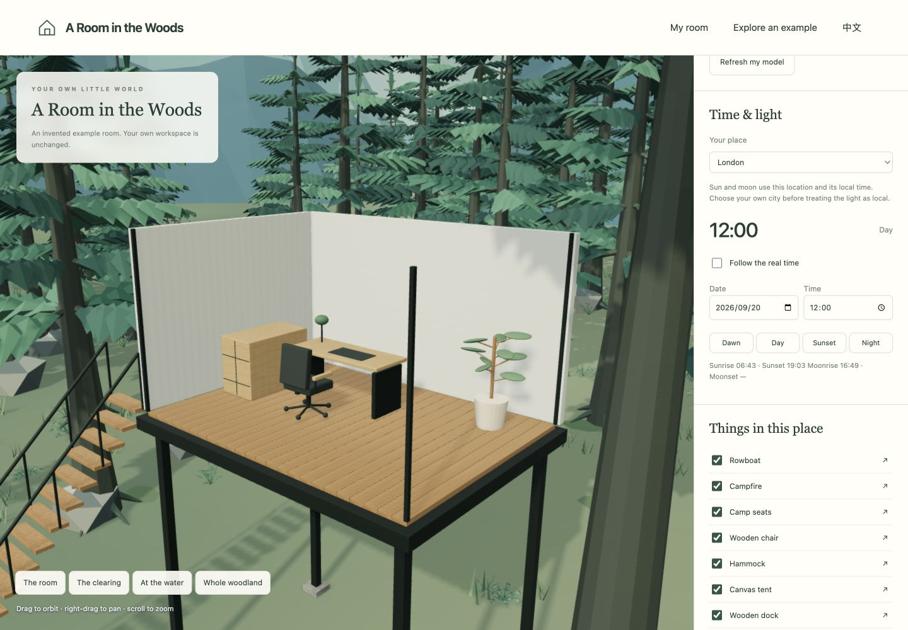
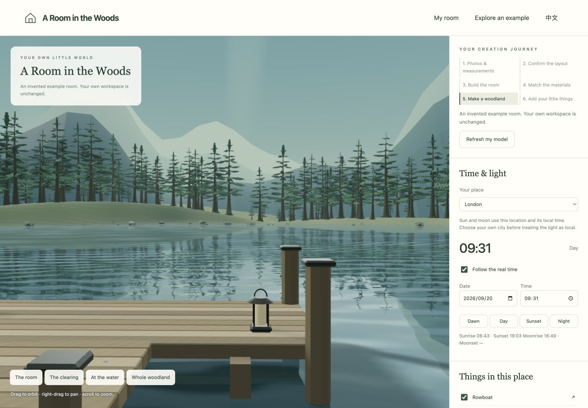

# 一步步，做出属于自己的林间小屋

你只需要提供照片、尺寸和想法。安装、建模、做网页这些技术操作，都交给 Codex。

## 第一步：把项目链接发给 Codex

复制这个项目的 GitHub 链接，再加上一句话：

> 请把这个项目下载到一个新文件夹，先读 AGENTS.md 和中文入门教程，再用中文一步步带我做自己的小屋。我不会建模和写代码，安装和技术操作请你完成。先从我的房间开始，不要直接拿示例房间替代。

Codex 会准备文件夹并打开本地工作台。遇到软件安装或电脑系统需要你授权时，它会告诉你怎么做。你需要自己的 Codex 使用权限；项目本身不需要注册账号或填写 API Key。

**这一步完成时：** 你会看到照片、尺寸、开始制作的引导页面。示例只是用来看看效果。

## 第二步：拍四个方向，告诉它几个尺寸

站在房间中间，朝每面墙各拍一张。把墙角、门、窗和主要家具尽量拍完整。普通手机、自然光就可以。

| 信息 | 告诉 Codex 什么 |
|---|---|
| 房间 | 长、宽、层高 |
| 门和窗 | 在哪面墙，大概长宽，知道的话补充离墙角多远 |
| 主要家具 | 书桌、柜子、大椅子的尺寸与位置 |
| 你的城市 | 用于当地时间和日夜；知道窗户朝向的话也告诉它 |
| 保留与忽略 | 哪些物品必须保留，哪些杂物不用做 |

厘米、米都可以。不确定的直接说“估计”，没量的也直接说，不用为了填完整而乱猜。

可以这样说：

> 这是房间四个方向的照片。房间大概宽 4.6 米、深 3.4 米、层高 2.6 米，是估计值。书桌是 1.7 × 0.7 × 0.74 米。保留台灯和绿植，不用做衣服。我在上海。请先告诉我你理解的布局，再开始制作。

这里的尺寸只是举例，不是让你照着填。

**这一步完成时：** Codex 会用简单的话或示意图和你确认布局。门、窗、家具的大位置对了，再往下做。

## 第三步：先把房间做像

Codex 会给你一个可以转着看的三维房间。先看空间关系：

- 门窗的位置、大小对不对？
- 房间是不是太高、太窄或太长？
- 桌子、椅子、柜子的摆放对不对？

可以直接说：

> 桌子是对的，柜子还要靠近门一些。天花板再低一点。改之前先存档。

截图后画一个箭头、圈出位置，通常比长篇描述更清楚。第一版只是空间骨架，Codex 会继续根据你的照片调整。你不用自己打开建模软件。

**这一步完成时：** 从几个角度看，都能认出这是你的房间，并且已经有存档。

## 第四步：补拍材质，让它更真实

这是很关键的一步：**额外拍一下材质和重要物品的细节。** 大场景照片往往看不清木纹、玻璃、椅子的形状和表面质感。

| 补拍什么 | 哪些信息有帮助 |
|---|---|
| 地板，朝下拍 | 板子宽度、木纹方向、冷暖颜色 |
| 柜子的正面和侧面 | 木色、柜门、把手、是否有光泽 |
| 关上的房门 | 门框、玻璃纹理、合页、门把手 |
| 椅子正面和侧面 | 整体轮廓、扶手、坐垫、底座 |
| 天花板 | 裸水泥、房梁、管线和灯具 |
| 台灯、喜欢的小物件 | 真实颜色、造型、大概尺寸 |

尽量用均匀的自然光。很黄的灯光会把材质拍偏色。重要物品可以拍“完整形状 + 局部细节”，有衣物或杂物就说明忽略。

例如：

> 柜子现在偏白了，请按这张图调整成暖木色。台灯是绿色的。天花板是水泥裸顶。椅子按正面和侧面照片做，不用建模上面的衣服。保留已经确认好的房间布局。

**这一步完成时：** 不是单纯东西更多，而是颜色、材质、轮廓更像你的房间。先在白天看，再切晚霞或夜景。

## 第五步：从房间，扩展到森林

房间已经有熟悉感后，可以说：

> 把我的房间放进一个安静的插画风森林，保持项目原本的整体质感。加上合理的入口、楼梯和通向湖边的小路。先保留房间布局，存一个版本后再逐步增加细节。

项目准备了松树、远山、流动湖面、码头和小船。Codex 会根据你的房间调整空地和支架；房间很大或形状特别时，也需要一起调整周围环境。

在“此时此地”里选择自己的城市，太阳和月亮就会按当地日期、时间运行。可以切换清晨、白天、晚霞、夜晚检查光影。如果不知道窗户朝向，第一版的房间方向先作为临时设定。

**这一步完成时：** 从房间走向楼梯、空地、湖岸，空间关系合理；物品贴着地面，湖水也能和岸边接上。

## 第六步：放进自己喜欢的东西

“添一件东西”里可以添加帐篷、吊床、篝火、座凳、码头和小船。每一件都有单独的显示开关和定位箭头。

想加自己的物品，发照片，再标明位置：

> 把这张画挂在书桌旁边。第一张是原图，第二张是我圈出位置的截图。需要能单独显示和隐藏。加完保存一个新版本。

想听声音时，再主动开启环境音。白天有鸟鸣，夜晚有虫鸣；动效也能关闭。没有规定必须加哪些东西，舒服就好。

## 第七步：保存，随时回来

每次修改前让 Codex 存档，也可以点“保存一个版本”。存档包含模型源文件、材质、代码和设置；恢复旧版前还会先保存当前内容。

> 这个版本我很喜欢，保存为“我的第一间林间小屋”。记录一下现在完成了什么，下次可以从哪里继续。

下次打开同一个项目文件夹，告诉 Codex：

> 继续我的小屋。先读取保存的进度，启动网页，带我回到上次的版本。

保留整个项目文件夹，包括隐藏的 `.versions` 存档文件夹。也可以在自己的备份盘上留一份，避免电脑丢失时一起丢掉。本地版本存档不能代替异地备份。

做到你喜欢就可以了。不用学习 GitHub，不用上传，也不用向别人分享。

## 遇到这些情况怎么办

- **网页打不开：** 让 Codex 重新启动本地工作台。本地地址需要服务正在运行。
- **某个位置闪烁：** 截图标明位置，描述在哪个角度出现，让 Codex 检查模型表面相互重叠的问题，并拉近拉远验证。
- **还不像你的房间：** 先改尺寸比例，再补材质和物品的细节照片。
- **电脑有点卡：** 开启“轻量画面”，必要时请 Codex 减少场景复杂度。
- **想回到上一版：** 在“我的存档”里恢复，或直接请 Codex 帮你恢复。
